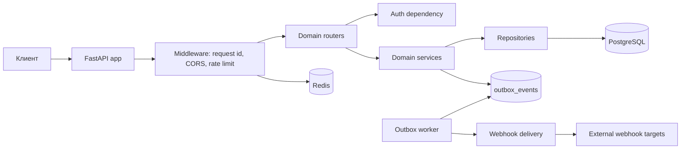

# Portfolio Review FlowForge API

Этот документ фиксирует сильные стороны проекта и дальнейшие точки роста для
портфолио backend-разработчика.

## Краткое описание

FlowForge API - backend на FastAPI для совместной работы с задачами. В проекте
есть регистрация пользователей, JWT login, ротация refresh-токенов, организации,
роли участников, проекты, задачи, комментарии, история статусов, Redis rate
limiting, PostgreSQL, Alembic migrations, webhook subscriptions и outbox worker
для асинхронной доставки webhook.

## Что уже хорошо показывает проект

- Domain-based структура пакетов.
- Тонкие роутеры и вынесенная бизнес-логика в сервисы.
- Async SQLAlchemy 2.x.
- Единый error envelope для доменных ошибок.
- Argon2 password hashing через `pwdlib`.
- JWT issuer/audience validation.
- Refresh-token rotation с отзывом token family.
- Optimistic locking при обновлении задач.
- Outbox pattern с `FOR UPDATE SKIP LOCKED`.
- Structured JSON logging через `structlog`.
- Prometheus `/metrics` для HTTP, outbox и webhook worker метрик.
- Проверка production secrets при `APP_ENV=production`.
- Dockerfile, dev compose и production compose.
- CI/CD pipeline с linting, formatting, typing, tests, coverage, security scan,
  dependency audit, Docker build и публикацией image в GHCR.

## Текущая архитектура



## Основные точки роста

### P0

1. Защитить refresh-token rotation от race condition.
   Сейчас refresh session читается, затем отзывается, затем создается новая.
   Для конкурентных refresh-запросов стоит добавить row-level lock:

   ```python
   statement = (
       select(RefreshSession)
       .where(RefreshSession.jti == jti)
       .with_for_update()
   )
   ```

2. Усилить SSRF-защиту webhook delivery.
   Сейчас hostname проверяется при валидации URL, но при реальной отправке
   клиент снова резолвит адрес. Лучше валидировать адрес на момент отправки,
   запретить redirects и отклонять private/link-local/reserved IP.

### P1

3. Добавить pagination для list endpoints.
   В проекте уже есть `PaginatedResponse`, но списки задач, комментариев и
   истории пока не используют единый pagination contract.

4. Проверять, что assignee задачи является участником организации.
   Сейчас `assigned_to_id` можно принять из create/update payload без отдельной
   проверки membership.

5. Либо реализовать, либо убрать неполные features.
   `audit` и `idempotency` уже имеют модели, но пока не подключены к workflows.
   Для портфолио лучше, чтобы заявленные production-паттерны были полностью
   рабочими.

### P2

6. Вынести authorization logic в policy layer.
   Проверки ролей повторяются в нескольких сервисах. Лучше ввести
   `OrganizationAccessPolicy` с методами `require_member`, `require_admin`,
   `can_access_project`.

7. Улучшить membership lookup в `ProjectService`.
   Для проверки доступа лучше использовать точечный `get_member` или `exists`,
   а не загрузку лишних данных.

8. Сделать rate limiting более точным.
   Сейчас ключ строится по IP и path. Для authenticated routes лучше
   использовать user ID, а IP оставить fallback.

## Следующие улучшения для портфолио

1. Реализовать pagination на list endpoints.
2. Добавить policy layer для authorization.
3. Добавить integration tests для auth API flow: register -> login -> refresh
   -> logout.
4. Добавить OpenAPI contract artifact в CI.
5. Усилить webhook SSRF defense и протестировать edge cases.

## Итог

Проект уже хорошо демонстрирует современный Python backend: FastAPI,
PostgreSQL, Redis, Alembic, Docker, CI/CD, typed code, tests и security checks.
Главное направление роста - закрыть несколько production edge cases и расширить
интеграционные тесты.
